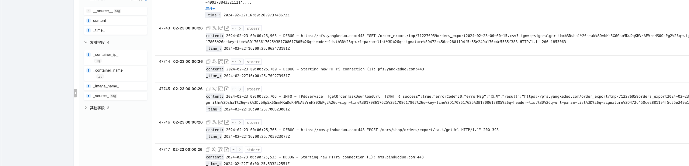

# pdd-merchant
# 拼多多商家组件
> 本组件包适用于php开发 基于拼多多商家后台进行全爬虫逆向提取协议而封装

## composer安装命令
```shell
composer require yunzhiyike/pdd-merchant
```

## 私有化部署加密服务说明🌲
> 因为在登录过程中存在登录加密以及风控验证码所以SDK需要配合拼多多加密服务一起使用，目前为收费服务如有需要可以联系`wuaiyiyun2022@163.com`购买部署

## 企业方案落地预览
### 1、企业告警

### 2、采集日志

### 3、生产环境日志

## 使用说明
### 1、登录流程
```php
////////////////  登录步骤 /////////////////
$pddMerchant = new PddMerchant(60, '远程拼多多加密服务地址', '远程拼多多加密服务token');

 // 发送验证码
$pddMerchant->sendSmsCode('拼多多商家账号/子账号');

// 登录 返回登录账号信息和cookie
$info = $pddMerchant->login('拼多多商家账号/子账号', '密码', '验证码');

// 获取登录成功后的授权cookie
$cookie = $pddMerchant->getCookie();

// 生命周期检查
$isLogin = $pddMerchant->checkLogin();


////////////////  订单导出步骤 /////////////////
// 创建订单导出任务
$startTime = 1698768000;
$endTime = 1702362388;
$pddMerchant->createOrderTask($startTime, $endTime);

// 获取订单导出任务列表
$res = $pddMerchant->getOrderTaskList(1, 10);

$orderTaskList = $res['pageItems'];
foreach ($orderTaskList as $orderTask) {
       // 根据刚刚导出的时间范围条件找到任务id
       if ($orderTask['groupStartTime'] == $startTime && $orderTask['groupEndTime'] == $endTime) {
           $taskId = $orderTask['id'];
           // 根据找到的任务id获取真实的下载地址
           $downloadUrl = $pddMerchant->getOrderTaskDownloadUrl($taskId);
           var_dump($downloadUrl);
           break;
       }
}


// 订单号对应的开始时间和结束时间必须是这个订单创建的范围
$comments = $pddMerchant->getOrderComments('xxx-xxxx', $startTime, $endTime)

// 获取昨日经营数据（对应拼多多商家后台的数据中心->经营总览）
$data = $pddMerchant->queryMallScoreOverView()

```
### 2、财务接口
> 登录后还无法直接调用财务接口来获取财务数据还需要对登录cookie进行财务二次鉴权
```php
$pddMerchant = new PddMerchant(60, '远程拼多多加密服务地址', '远程拼多多加密服务token');

 // 发送验证码
$pddMerchant->sendSmsCode('拼多多商家账号/子账号');

// 登录 返回登录账号信息和cookie
$info = $pddMerchant->login('拼多多商家账号/子账号', '密码', '验证码');


// 财务二次鉴权
$pddMerchant->finances2Auth();

// 调用获取财务月度数据报表
$billingReport = $pddMerchant->queryMallBalanceMonthlySummary('2023-01', '2024-01');

// 新建财务流水导出任务
$pddMerchant->createBillDownloadTask(1698768000, time());

// 获取财务流水任务列表（在这里可以下载财务流水）
$taskList = $pddMerchant->queryBillDownloadTaskList(1, 10);
```

### 3、拼多多推广
> 登录后还无法直接调用拼多多推广相关接口来获取推广数据还需要对登录cookie进行拼多多推广二次鉴权
```php
$pddMerchant = new PddMerchant(60, '远程拼多多加密服务地址', '远程拼多多加密服务token');

 // 发送验证码
$pddMerchant->sendSmsCode('拼多多商家账号/子账号');

// 登录 返回登录账号信息和cookie
$info = $pddMerchant->login('拼多多商家账号/子账号', '密码', '验证码');

// 拼多多推广二次授权
$pddMerchant->promotion2Auth()
```

### 4、多多视频
> 登录后还无法直接调用多多视频接口来获取多多视频数据还需要对登录cookie进行多多视频二次鉴权
```php
$pddMerchant = new PddMerchant(60, '远程拼多多加密服务地址', '远程拼多多加密服务token');

 // 发送验证码
$pddMerchant->sendSmsCode('拼多多商家账号/子账号');

// 登录 返回登录账号信息和cookie
$info = $pddMerchant->login('拼多多商家账号/子账号', '密码', '验证码');

// 多多视频二次授权
$pddMerchant->ddsp2Auth()
```
# 免责声明
> 禁止使用该组件包进行任何违法犯罪行为，否则后果自负与作者无关！
